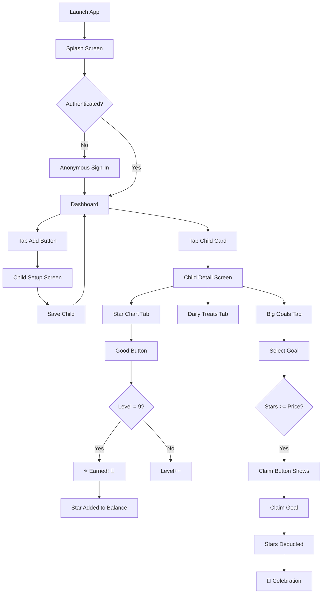

# Auliya – Islamic Gamified Habit Tracker for Children
**Hybrid Mobile Application Development (INFO 4335)**

---

## a) Group Members

| Name | Matric Number |
|------|---------------|
| Mohamad Imad Addin Bin Ja'far | 2127923 |
| Shopno Md Tanvir Ahmmed | 2219061 |

---

## b) Project Title

**Auliya** – A Cross-Platform Islamic Gamified Habit Tracker for Children

---

## c) Introduction

### Problem & Motivation

Parents play a crucial role in shaping children's habits and moral values from an early age. In Muslim households, parents aim to instill habits such as performing daily prayers, reading the Qur'an, reciting duʿāʾ, and developing good manners. However, many parents face challenges due to busy schedules and lack of effective monitoring tools.

Most existing habit-tracking applications are **generic** and not designed specifically for children. They often do not incorporate **Islamic values** or provide appropriate parental control mechanisms.

### Relevance

**Auliya** bridges the gap between traditional habit-tracking methods and modern mobile technology by offering an engaging, ethical, and Islamic-focused solution for families. The application integrates Islamic teachings with modern mobile technology to create a family-friendly, ethical, and engaging digital experience.

---

## d) Objectives

1. Develop a **cross-platform mobile application** using Flutter for Android and iOS
2. Design a **gamified habit tracking system** that motivates children to perform daily good deeds
3. Provide **parent-managed child profiles** for individualized habit monitoring
4. Implement a **star-based reward system** that reinforces positive behavior
5. Integrate **Islamic educational content** (duʿāʾ) in a child-friendly format
6. Visualize progress using **charts and analytics**
7. Ensure **Shariah-compliant, ethical, and privacy-focused** principles

---

## e) Target Users

| User Type | Description |
|-----------|-------------|
| **Primary** | Muslim parents/guardians (25-45 years) who wish to guide and monitor children's daily habits |
| **Secondary** | Children (3-15 years) who interact with the app through visual feedback and rewards under parental supervision |

---

## f) Features and Functionalities

### Core Modules

| Module | Description | Status |
|--------|-------------|--------|
| **Authentication** | Anonymous Firebase auth (Google Sign-In planned) | ✅ Implemented |
| **Dashboard** | Child cards with glassmorphism design, animated background | ✅ Implemented |
| **Child Management** | Add/Edit/Delete child profiles with photo, name, DOB | ✅ Implemented |
| **Star Chart (Akhlaq Harian)** | 10-level rocket animation, earn stars on completion | ✅ Implemented |
| **Daily Treats** | Small rewards claimable after earning stars | ✅ Implemented |
| **Big Goals** | Large rewards with star progress grid, bank-like balance system | ✅ Implemented |
| **Duʿāʾ Collection** | Islamic prayers with translations | 🔄 Partial |
| **Progress Charts** | Visual analytics with fl_chart | 🔄 Partial |
| **Firebase Storage** | Cloud image storage with local fallback | ✅ Implemented |

### UI Components

- **Splash Screen**: Lottie animation with Firebase initialization
- **Navigation Drawer**: User profile, settings, sign-out
- **Child Cards**: Glassmorphism with gradient borders, glowing avatars
- **Star Progress Grid**: Animated cells with smart scaling for large goals
- **Celebration Dialogs**: Confetti animations on achievements

### Interactions

- Tap child card → Navigate to child detail
- Swipe left on treats/goals → Delete
- Long press goal card → Delete confirmation
- Tap image placeholder → Camera/Gallery picker with square crop

---

## g) Proposed UI Mock-up

> **Note**: Wireframes created in Figma. Key screens:

| Screen | Description |
|--------|-------------|
| Splash | Animated logo with loading indicator |
| Dashboard | Grid of child cards with floating add button |
| Child Detail | Tab layout: Star Chart, Daily Treats, Big Goals |
| Star Chart | Rocket animation with Good/Bad buttons |
| Treats List | Swipeable reward cards with claim button |
| Goals View | Horizontal goal selector + star progress grid |

*Figma wireframes to be attached separately*

---

## h) Architecture / Technical Design

### Widget/Component Structure

```
lib/
├── main.dart                 # App entry, providers, theme
├── models/
│   ├── child_model.dart      # Child data with treats & goals
│   ├── daily_treat_model.dart
│   └── big_goal_model.dart
├── providers/
│   └── child_provider.dart   # ChangeNotifier for state
├── screens/
│   ├── splash_screen.dart
│   ├── dashboard_screen.dart
│   ├── child_setup_screen.dart
│   └── child_detail_screen.dart
├── services/
│   ├── auth_service.dart
│   ├── database_service.dart
│   ├── audio_service.dart
│   ├── image_picker_service.dart
│   └── image_upload_service.dart
└── widgets/
    ├── akhlaq_harian_widget.dart
    ├── daily_treats_widget.dart
    ├── big_goals_widget.dart
    └── star_progress_grid.dart
```

### State Management Approach

**Provider** (ChangeNotifier pattern)

```dart
// main.dart
MultiProvider(
  providers: [
    ChangeNotifierProvider(create: (_) => ChildProvider()),
  ],
  child: MaterialApp(...),
)

// Usage in widgets
context.read<ChildProvider>().addChild(child);
context.watch<ChildProvider>().children; // Reactive rebuild
```

**Why Provider?**
- Lightweight and officially recommended
- Easy to learn for academic projects
- Sufficient for app complexity
- Clean separation of UI and business logic

---

## i) Data Model

### Firestore Collection-Document Model

```
users/
└── {userId}/
    └── children/
        └── {childId}/
            ├── name: string
            ├── age: string (DOB format)
            ├── img: string (URL or local path)
            ├── level: int (0-9)
            ├── star: int (bank balance)
            ├── treatsAvailable: int
            ├── dailyTreats: array
            │   └── { name, img }
            ├── bigGoals: array
            │   └── { name, img, price, isClaimed }
            └── selectedGoalIndex: int?
```

### Entity Relationship Diagram

```
┌─────────────┐       ┌─────────────┐       ┌─────────────┐
│    User     │ 1───n │   Child     │ 1───n │ DailyTreat  │
│  (Firebase) │       │             │       │             │
│  ─────────  │       │  ─────────  │       │  ─────────  │
│  uid        │       │  id         │       │  name       │
│  anonymous  │       │  name       │       │  img        │
└─────────────┘       │  age        │       └─────────────┘
                      │  img        │
                      │  level      │       ┌─────────────┐
                      │  star       │ 1───n │  BigGoal    │
                      │  treats     │       │             │
                      └─────────────┘       │  ─────────  │
                                            │  name       │
                                            │  img        │
                                            │  price      │
                                            │  isClaimed  │
                                            └─────────────┘
```

---

## j) Flowchart / Sequence Diagram

### User Navigation Flow



### Star Earning Sequence Diagram

```
Parent          StarChart           ChildModel         Firebase
  │                 │                    │                │
  │  Tap "Good"     │                    │                │
  │────────────────>│                    │                │
  │                 │  increaseScore()   │                │
  │                 │───────────────────>│                │
  │                 │                    │ level++        │
  │                 │                    │ if level>=9:   │
  │                 │                    │   star++       │
  │                 │                    │   level=0      │
  │                 │  return earned     │                │
  │                 │<───────────────────│                │
  │                 │                    │                │
  │                 │        updateChild()                │
  │                 │────────────────────────────────────>│
  │  Show Dialog    │                    │                │
  │<────────────────│                    │                │
```

---

## k) References

### Flutter & Dart
- Flutter Documentation: https://docs.flutter.dev
- Dart Language Tour: https://dart.dev/language
- Provider Package: https://pub.dev/packages/provider

### Firebase
- Firebase for Flutter: https://firebase.google.com/docs/flutter/setup
- Cloud Firestore: https://firebase.google.com/docs/firestore
- Firebase Authentication: https://firebase.google.com/docs/auth

### UI/UX Design
- Material Design 3: https://m3.material.io
- Lottie Animations: https://lottiefiles.com
- Google Fonts: https://fonts.google.com/specimen/Nunito

### Packages Used
| Package | Purpose |
|---------|---------|
| provider | State management |
| firebase_core | Firebase initialization |
| firebase_auth | Authentication |
| cloud_firestore | Database |
| firebase_storage | Image storage |
| lottie | Animations |
| google_fonts | Typography |
| image_picker | Camera/Gallery |
| image_cropper | Square crop |
| audioplayers | Sound effects |
| fl_chart | Progress charts |

---

## Project Constraints

- Limited development time within academic semester
- Dependency on internet connectivity for Firebase services
- Requirement to comply with Islamic and ethical guidelines
- Learning curve associated with Flutter and Firebase integration

---

## Development Stages

1. ✅ Requirement analysis and project planning
2. ✅ UI/UX design and navigation flow
3. ✅ Backend setup and Firebase integration
4. ✅ Core feature implementation
5. 🔄 Testing and debugging
6. 🔄 Final documentation and presentation

---

*Last Updated: January 2026*
