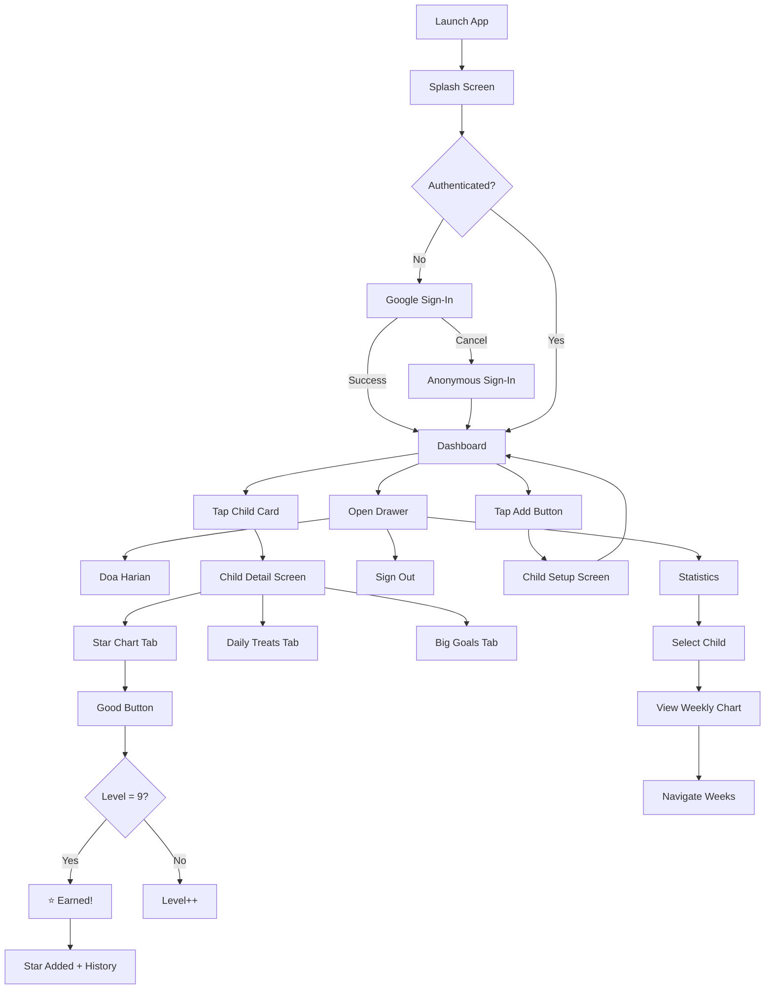

# Auliya – Islamic Gamified Habit Tracker for Children
**Hybrid Mobile Application Development (INFO 4335)**

---

## a) Group Members

| Name | Matric Number |
|------|---------------|
| Mohamad Imad Addin Bin Ja'far | 2127923 |
| Shopno Md Tanvir Ahmmed | 2219061 |

---

## b) Project Title

**Auliya** – A Cross-Platform Islamic Gamified Habit Tracker for Children

---

## c) Introduction

### Problem & Motivation

Parents play a crucial role in shaping children's habits and moral values from an early age. In Muslim households, parents aim to instill habits such as performing daily prayers, reading the Qur'an, reciting duʿāʾ, and developing good manners. However, many parents face challenges due to busy schedules and lack of effective monitoring tools.

Most existing habit-tracking applications are **generic** and not designed specifically for children. They often do not incorporate **Islamic values** or provide appropriate parental control mechanisms.

### Relevance

**Auliya** bridges the gap between traditional habit-tracking methods and modern mobile technology by offering an engaging, ethical, and Islamic-focused solution for families.

---

## d) Objectives

1. Develop a **cross-platform mobile application** using Flutter for Android and iOS
2. Design a **gamified habit tracking system** that motivates children to perform daily good deeds
3. Provide **parent-managed child profiles** for individualized habit monitoring
4. Implement a **star-based reward system** that reinforces positive behavior
5. Integrate **Islamic educational content** (duʿāʾ collection) in a child-friendly format
6. Visualize progress using **weekly charts and statistics**
7. Ensure **Shariah-compliant, ethical, and privacy-focused** principles

---

## e) Target Users

| User Type | Description |
|-----------|-------------|
| **Primary** | Muslim parents/guardians (25-45 years) who wish to guide and monitor children's daily habits |
| **Secondary** | Children (3-15 years) who interact with the app through visual feedback and rewards under parental supervision |

---

## f) Features and Functionalities

### Core Modules

| Module | Description | Status |
|--------|-------------|--------|
| **Google Sign-In Authentication** | Firebase auth with Google Sign-In, anonymous fallback | ✅ Implemented |
| **Dashboard** | Child cards with glassmorphism, spacebg backdrop, blur effects | ✅ Implemented |
| **Child Management** | Add/Edit/Delete child profiles with photo, name, DOB | ✅ Implemented |
| **Star Chart (Akhlaq Harian)** | 10-level rocket animation, earn stars on completion | ✅ Implemented |
| **Daily Treats** | Small rewards claimable after earning stars | ✅ Implemented |
| **Big Goals** | Large rewards with star progress grid, bank-like balance | ✅ Implemented |
| **Duʿāʾ Collection** | 10 Islamic prayers with Arabic, transliteration, meaning | ✅ Implemented |
| **Statistics** | Weekly bar chart, child selector, per-child achievements | ✅ Implemented |
| **Firebase Storage** | Cloud image storage for child/goal photos | ✅ Implemented |

### UI Components

- **Splash Screen**: Lottie animation with space background, Google Sign-In
- **Navigation Drawer**: Google profile picture/name, navigation items
- **Child Cards**: Glassmorphism with BackdropFilter blur, gradient borders
- **Star Progress Grid**: Animated cells with smart scaling
- **Celebration Dialogs**: Confetti animations on achievements
- **Weekly Chart**: fl_chart bar chart with week navigation

### Interactions

| Gesture | Action |
|---------|--------|
| Tap child card | Navigate to child detail screen |
| Swipe left on treats/goals | Delete with confirmation |
| Tap image placeholder | Camera/Gallery picker with square crop |
| Tap Good/Bad button | Increase/decrease level, earn stars |
| Tap ≡ menu | Open navigation drawer |

---

## g) UI Screenshots

### Splash Screen
Space background with Lottie rocket animation, Google Sign-In prompt.

### Dashboard

- Custom banner logo
- Glassmorphic child cards with blur effect
- Floating add button

### Child Detail Tabs
1. **Star Chart** – Rocket animation with Good/Bad buttons
2. **Daily Treats** – Swipeable reward cards
3. **Big Goals** – Goal cards with progress grid

### Doa Harian Screen
Expandable cards with Arabic text, transliteration, and meaning.

### Statistics Screen
- Child selector dropdown
- Weekly bar chart with navigation
- Summary stats (stars, goals, treats)
- Achievements badges

---

## h) Architecture / Technical Design

### Widget/Component Structure

```
lib/
├── main.dart                 # App entry, providers, theme
├── models/
│   ├── child_model.dart      # Child data with treats, goals, starHistory
│   ├── daily_treat_model.dart
│   ├── big_goal_model.dart
│   ├── dua_model.dart
│   └── star_entry_model.dart
├── providers/
│   └── child_provider.dart   # ChangeNotifier for state management
├── screens/
│   ├── splash_screen.dart    # Lottie + Google Sign-In
│   ├── dashboard_screen.dart # Main screen with child grid
│   ├── child_setup_screen.dart
│   ├── child_detail_screen.dart
│   ├── doa_screen.dart       # Islamic prayers collection
│   └── stats_screen.dart     # Weekly statistics
├── services/
│   ├── auth_service.dart     # Google + Anonymous auth
│   ├── database_service.dart # Firestore operations
│   ├── audio_service.dart    # Sound effects
│   ├── image_picker_service.dart
│   └── image_upload_service.dart
└── widgets/
    ├── akhlaq_harian_widget.dart
    ├── daily_treats_widget.dart
    ├── big_goals_widget.dart
    └── star_progress_grid.dart
```

### State Management Approach

**Provider** (ChangeNotifier pattern)

```dart
MultiProvider(
  providers: [
    Provider<AuthService>(create: (_) => AuthService()),
    ChangeNotifierProvider(create: (_) => ChildProvider()),
  ],
  child: MaterialApp(...),
)

// Usage in widgets
context.read<ChildProvider>().addChild(child);
context.watch<ChildProvider>().children; // Reactive rebuild
```

**Why Provider?**
- Lightweight and officially recommended
- Clean separation of UI and business logic
- Easy to learn and maintain
- Sufficient for app complexity

---

## i) Data Model

### Firestore Collection-Document Model

```
users/
└── {userId}/
    └── children/
        └── {childId}/
            ├── name: string
            ├── age: string (DOB format)
            ├── img: string (Firebase Storage URL)
            ├── level: int (0-9)
            ├── star: int (bank balance)
            ├── treatsAvailable: int
            ├── dailyTreats: array
            │   └── { name, img }
            ├── bigGoals: array
            │   └── { name, img, price, isClaimed }
            ├── starHistory: array
            │   └── { date, count }
            └── selectedGoalIndex: int?
```

### Entity Relationship Diagram

```
┌─────────────┐       ┌─────────────┐       ┌─────────────┐
│    User     │ 1───n │   Child     │ 1───n │ DailyTreat  │
│  (Firebase) │       │             │       │             │
│  ─────────  │       │  ─────────  │       │  ─────────  │
│  uid        │       │  id         │       │  name       │
│  displayName│       │  name       │       │  img        │
│  photoURL   │       │  age        │       └─────────────┘
└─────────────┘       │  img        │
                      │  level      │       ┌─────────────┐
                      │  star       │ 1───n │  BigGoal    │
                      │  starHistory│       │             │
                      └─────────────┘       │  ─────────  │
                                            │  name       │
                                            │  img        │
                                            │  price      │
                                            │  isClaimed  │
                                            └─────────────┘
```

---

## j) Flowchart / Sequence Diagram

### User Navigation Flow



---

## k) References

### Flutter & Dart
- Flutter Documentation: https://docs.flutter.dev
- Dart Language Tour: https://dart.dev/language
- Provider Package: https://pub.dev/packages/provider

### Firebase
- Firebase for Flutter: https://firebase.google.com/docs/flutter/setup
- Cloud Firestore: https://firebase.google.com/docs/firestore
- Firebase Authentication: https://firebase.google.com/docs/auth
- Google Sign-In: https://firebase.google.com/docs/auth/flutter/federated-auth

### UI/UX Design
- Material Design 3: https://m3.material.io
- Lottie Animations: https://lottiefiles.com
- fl_chart: https://pub.dev/packages/fl_chart

### Packages Used

| Package | Version | Purpose |
|---------|---------|---------|
| provider | ^6.1.1 | State management |
| firebase_core | ^2.30.1 | Firebase initialization |
| firebase_auth | ^4.19.4 | Authentication |
| cloud_firestore | ^4.17.2 | Database |
| firebase_storage | ^11.7.0 | Image storage |
| google_sign_in | ^6.2.1 | Google authentication |
| lottie | ^3.1.0 | Animations |
| google_fonts | ^6.1.0 | Typography |
| image_picker | ^1.0.4 | Camera/Gallery |
| image_cropper | ^8.0.2 | Square crop |
| audioplayers | ^5.2.1 | Sound effects |
| fl_chart | ^0.66.2 | Progress charts |
| shared_preferences | ^2.2.2 | Local storage |

---

## Summary of Achieved Features

| Feature | Implementation |
|---------|----------------|
| **Authentication** | Google Sign-In with anonymous fallback |
| **Dashboard** | Custom space background, glassmorphic cards with blur |
| **Child Profiles** | Full CRUD with Firebase Storage images |
| **Star Chart** | 10-level rocket animation, sounds, celebratory dialogs |
| **Daily Treats** | Add/delete treats, claim mechanics |
| **Big Goals** | Star progress grid, claim when affordable |
| **Doa Collection** | 10 prayers with expandable cards |
| **Statistics** | Weekly bar chart, child selector, achievements |
| **Data Persistence** | Cloud Firestore with real-time sync |

---

## Limitations and Future Enhancements

### Current Limitations
- Star history only tracks stars earned after implementation
- No push notifications for reminders
- Single device per account (no multi-device sync indicator)

### Future Enhancements
- Push notifications for prayer times
- Multi-language support (Malay, Arabic)
- More duʿāʾ with audio recitation
- Family sharing between parents
- Yearly statistics view
- Export progress reports

---

## Development Stages

1. ✅ Requirement analysis and project planning
2. ✅ UI/UX design and navigation flow
3. ✅ Backend setup and Firebase integration
4. ✅ Core feature implementation
5. ✅ Statistics and Doa screens
6. ✅ Google Sign-In integration
7. ✅ Testing and debugging
8. ✅ Final documentation

---

*Last Updated: January 16, 2026*
